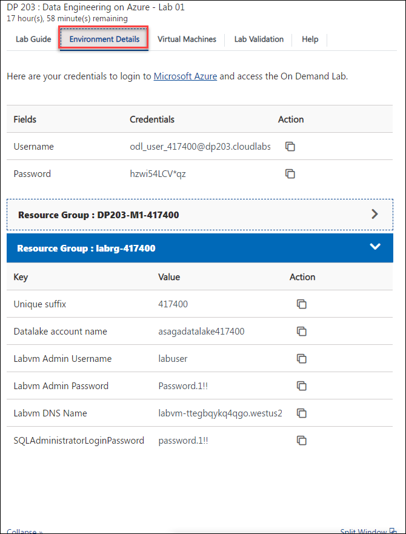
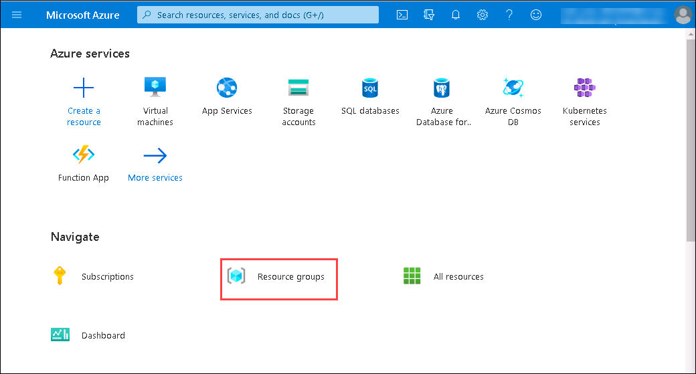

## **Getting Started**

1. Once the environment is provisioned, a virtual machine and lab guide will get loaded into your browser. Use this virtual machine throughout the workshop to perform the lab.
   
   
   
1. To get the lab environment details, you can select the Environment Details tab. Additionally, the credentials will also be sent to your email address provided during registration.

   

### Log-in to the Azure portal and verify the pre-deployed resources

1. In the LabVM, double click on the **Azure portal** shortcut on the desktop.

      
     
1. On **Sign in to Microsoft Azure** blade, you will see a login screen, in that enter the following email/username and then click on **Next**.  
   * **Azure Username/Email**:  <inject key="AzureAdUserEmail"></inject>
   * **Azure Password**:  <inject key="AzureAdUserPassword"></inject>
  
1. If you see the pop-up like below, click **Skip for now(14 days until this is required)**.

   

1. If you see the pop-up  **Stay Signed in?**, click **No**.

1. If you see the pop-up **You have free Azure Advisor recommendations!** , close the window to continue the lab. 

1. If a **Welcome to Microsoft Azure** popup window appears, click **Maybe Later** to skip the tour.

1. Now you can see the Azure Portal Dashboard, click on **Resource groups** from the Navigate panel to see the resource groups.
   
    
     
1. Navigate to the **DP203-M1-<inject key="DeploymentID"></inject>** Resource group and verify whether you have all the below resources deployed successfully.
  
     

   - Azure Databricks 
   - Storage account
   - Key vault
   - Event hub namespace
   - Synapse workspace
   - Apache Spark pool

   ***Please be informed that there is some temporary issue from Databricks, Please follow the below steps:***

   Step 1: Launch Workspace
    
     
   Step 2: Click on "Skip for now (14 days until this is required)"

   Step 3: Click on "Sign in with Azure AD"

    
     
   Step 4: Click on "Previous page" button on your browser two times until you are back on Databricks login page.

    
     
   Step 5: Now click on "Sign in with Azure AD" and click on "skip for now"

   
   
   Step 6: Verify if databricks cluster is pre-deployed.
   
   
   
   Step 7: If the cluster is in **Terminated** state, select the cluster and click on **start** and confirm.
   
   

1. Click on **Next** from the bottom right corner and follow the instructions to perform the lab.

### Modules Included

   In this hands on lab you will perform the following modules:

 - **Module 1 - Explore compute and storage options for data engineering workloads** 
 - **Module 6 - Data exploration and transformation in Azure Databricks**
 - **Module 15 - Create a stream processing solution with Event Hubs and Azure Databricks**

 **Note:** Ensure to stop the virtual machine once you are done using a particular lab environment. You can stop the VM using the lab environment page. Please navigate to the Virtual Machines tab and click the Stop icon.

   

