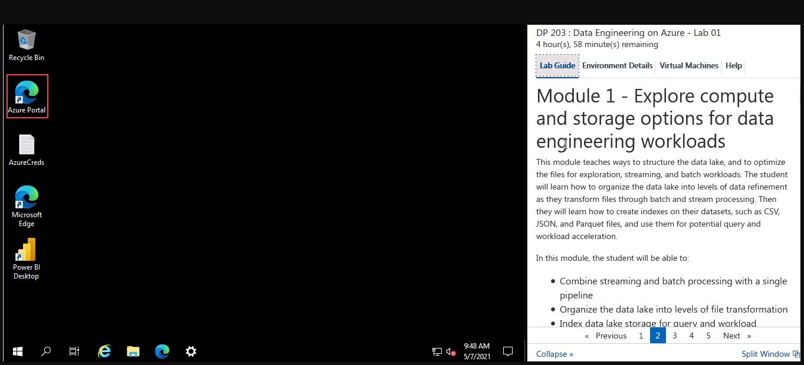

## **Getting Started**

### Log-in to the Azure portal

1. In the LabVM, double click on the Azure portal shortcut on the desktop.

      
     
1. On **Sign in to Microsoft Azure** blade, you will see a login screen, in that enter the following email/username and then click on **Next**.  
   * **Azure Username/Email**:  <inject key="AzureAdUserEmail"></inject>
   * **Azure Password**:  <inject key="AzureAdUserPassword"></inject>
  
1. If you see the pop-up like below, click **Skip for now(14 days until this is required)**.

   

1. If you see the pop-up  **Stay Signed in?**, click **No**.

1. If you see the pop-up **You have free Azure Advisor recommendations!** , close the window to continue the lab. 

1. If a **Welcome to Microsoft Azure** popup window appears, click **Maybe Later** to skip the tour.

   ***Please follow the below steps to login to Databricks Workspace:***

   Step 1: Launch Workspace

     
     
   Step 2: Click on "Skip for now (14 days until this is required)"

   Step 3: Click on "Sign in with Azure AD"

     

   Step 4: Click on "Previous page" button on your browser two times until you are back on Databricks login page.

     
     
   Step 5: Now click on "Sign in with Azure AD"

     

1. Click on **Next** from the bottom right corner and follow the instructions to perform the lab.

### Modules Included

   In this hands on lab you will perform the following modules:

 - **Module 1 - Explore compute and storage options for data engineering workloads** 
 - **Module 6 - Data exploration and transformation in Azure Databricks**
 - **Module 15 - Create a stream processing solution with Event Hubs and Azure Databricks**
