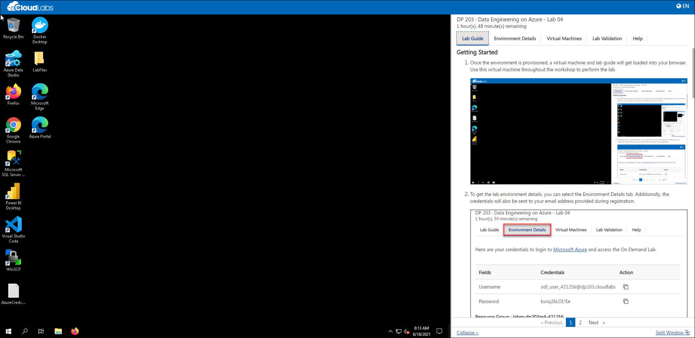
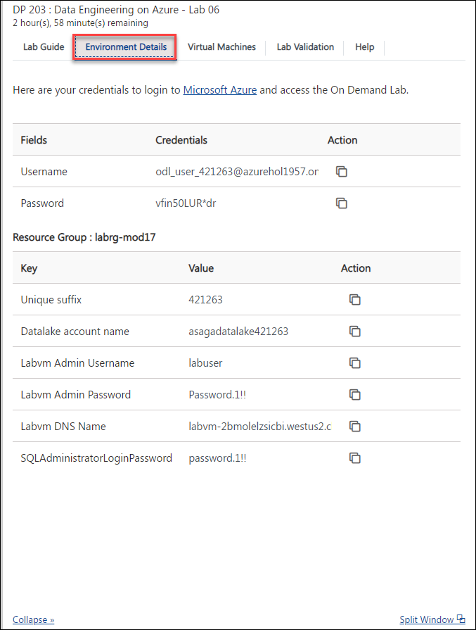
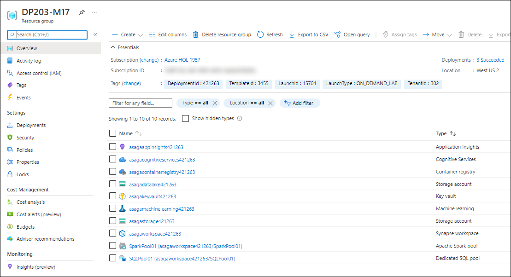

## **Getting Started**

1. Once the environment is provisioned, a virtual machine and lab guide will get loaded into your browser. Use this virtual machine throughout the workshop to perform the lab.
   
   
   
1. To get the lab environment details, you can select the Environment Details tab. Additionally, the credentials will also be sent to your email address provided during registration.

   

### Log-in to the Azure portal and verify the pre-deployed resources

1. In the LabVM, double click on the **Azure portal** shortcut on the desktop.

    
     
1. On **Sign in to Microsoft Azure** blade, you will see a login screen, in that enter the following email/username and then click on **Next**.  
   * **Azure Username/Email**:  <inject key="AzureAdUserEmail"></inject>
   * **Azure Password**:  <inject key="AzureAdUserPassword"></inject>
  
1. If you see the pop-up like below, click **Skip for now(14 days until this is required)**.

   

1. If you see the pop-up  **Stay Signed in?**, click **No**.

1. If you see the pop-up **You have free Azure Advisor recommendations!** , close the window to continue the lab. 

1. If a **Welcome to Microsoft Azure** popup window appears, click **Maybe Later** to skip the tour.

1. Now you can see the Azure Portal Dashboard, click on **Resource groups** from the Navigate panel to see the resource groups.
   
    
     
1. Navigate to the **DP203-M17** Resource group and verify whether you have all the below resources deployed successfully.
  
     

   - Application insights
   - Cognitive Services
   - Container registry
   -  Two Storage accounts
   - Key vault
   - Machine Learning
   - Synapse workspace
   - Apache spark pool
   - Dedicated SQL Pool
   
1. **Tools included:** *PowerBI Desktop* which is required is already installed in the VM.

1.  Click on **Next** from the bottom right corner and follow the instructions to perform the lab.

## **Modules Included**

In this hands-on lab you will perform the following module:

 - **Module 17 - Perform integrated Machine Learning processes in Azure Synapse Analytics**

